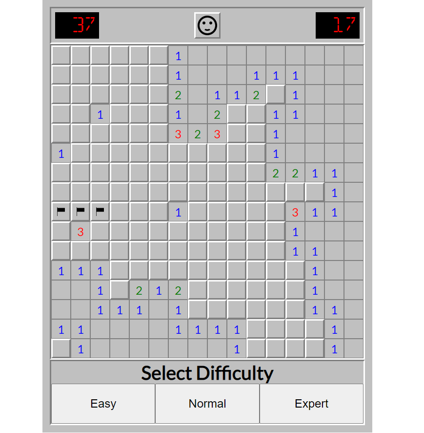

# Saper

Classic Saper Game written in JavaScript (ES5+) with classic Windows design written in CSS.

## Descriptions

It was a big game that I wrote myself based on the Object Oriented JavaScript course. I followed the course author step by step, writing the logic myself and correcting my mistakes against the teacher code which allowed me to develop my skills in object oriented programming.

## Technical

The game is object-oriented.The code was divided thanks to the use of ES6 modules. In addition, private class features were used. CSS variables proved to be very helpful in styling the game.

## Built With

- JavaScript (ES5+)
- HTML
- CSS
- [SVG SILH](https://svgsilh.com/) - Used to get some icons
- [1001 Fonts](https://www.1001fonts.com/) - Used to get fonts
- [Google Fonts](https://fonts.google.com/) - Used to get fonts

## Demo

https://viniski.github.io/Saper/

## License

This project is licensed under the MIT License
